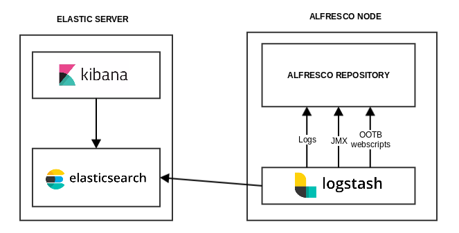
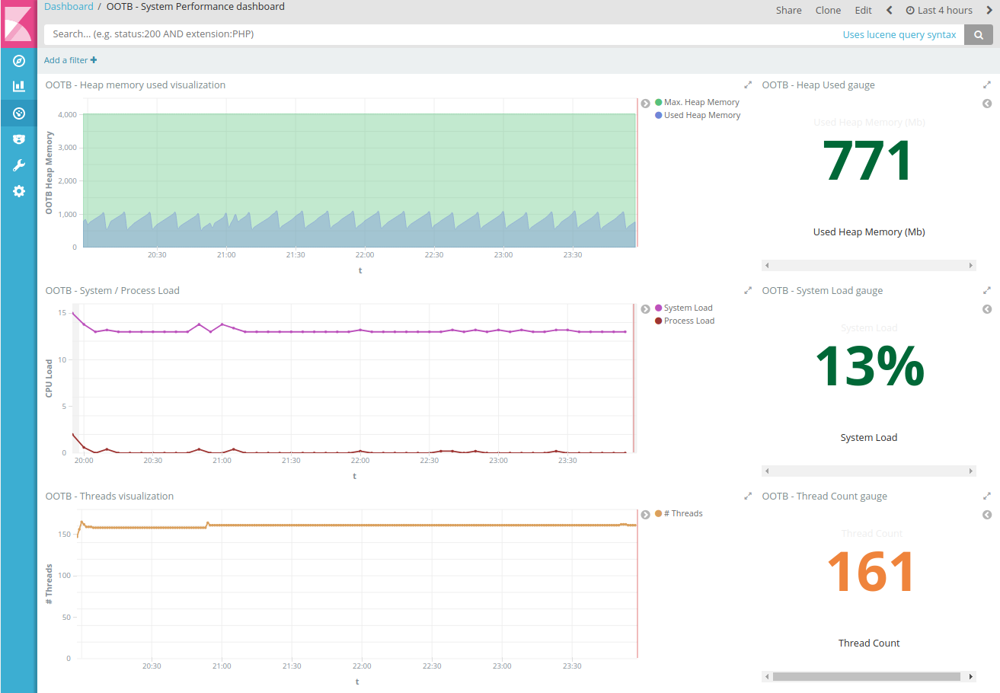
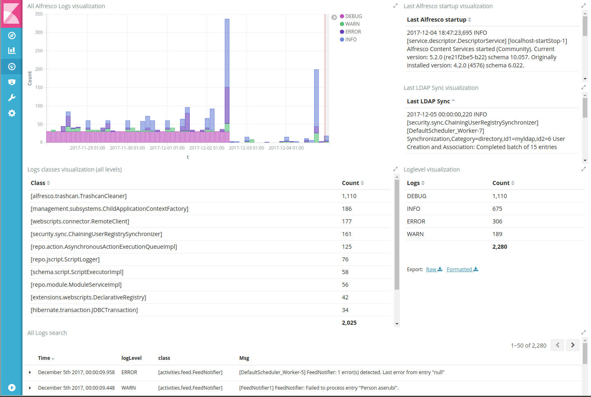
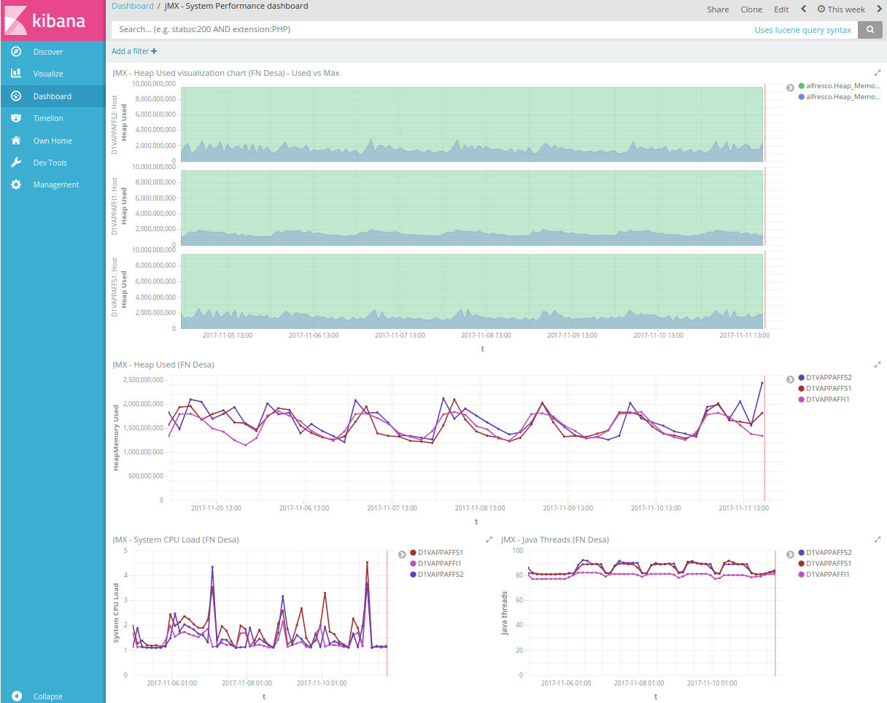

# ELK setup for Alfresco
Kibana dashboards for monitoring Alfresco 5.x: System performance, Active Sessions and Alfresco Logs  

## Table of Contents
- [Introduction](#introduction)
- [Basic Setup](#basic-setup)
- [ELK setup for Alfresco Community](#elk-setup-for-alfresco-community)
- [ELK setup for Alfresco Enterprise](#elk-setup-for-alfresco-enterprise)
- [Tested on](#tested-on)
- [Author](#author)
- [Links](#links)

## Introduction

ELK stack may be useful for Alfresco monitorization, including:
* JMX metrics in Alfresco Enterprise (such as database NumActive, TicketAllNonExpired or SOLR NumDocuments).
* A solution for your Alfresco logs.
* A support tools-like system performance and active sessions, but in a persisted way.

Different strategies may be done depending on Alfresco Community (via OOTB Support Tools webscripts) or Alfresco Enterprise (JMX information).

As you probably know ELK = Elastic Search + Logstash + Kibana
* Elastic Search is the index server
* Kibana is an interface for searching and visualizing the indexed data (logs, metrics)
* Logstash is the tool for extracting, transforming and loading data in Elastic Search 

## Basic Setup

## ELK setup for Alfresco Community

### Prerrequisites in Alfresco server

* Install [OOTB Support Tools addon](https://github.com/OrderOfTheBee/ootbee-support-tools)

### Configuration

* Install tools and startup scripts for Elastic, Kibana and Logstash.
* Install http-poller plugin for logstash (./bin/logstash-plugin install logstash-input-http_poller)
* Configure logstash.conf for http-poller
* Import searches, visualizations and dashboards in Kibana management.

### Available metrics via OOTB Support Tools webscripts

With [OOTB Support Tools addon](https://github.com/OrderOfTheBee/ootbee-support-tools), it is possible to extract useful information about JVM, threads or logged users via webscript. We can use the JSON information from the available webscripts of the addon (System Performance, Active Users and SOLR).

Some metrics are available via webscript using http-poller plugin in logstash:
- JVM Used memory
- Number of threads
- Number of active database connections
- Number of logged users
- Number of tickets
- System Load

## ELK setup for Alfresco Enterprise

### Prerrequisites in Alfresco server

* Enabling JMX in Alfresco server:
    * -Dcom.sun.management.jmxremote in setenv.sh (java process)
    * alfresco.jmx.connector.enabled=true in alfresco-global.properties

For more details, you can check [Alfresco docs](https://docs.alfresco.com/5.0/tasks/jmx-access.html)

### Configuration

* Install tools and startup scripts for Elastic, Kibana and Logstash.
* Install JMX plugin for logstash  (./bin/logstash-plugin install logstash-input-jmx)
* Configure logstash.conf for JMX input config and polling frequency
* JMX endpoint and available objects in jmx/jmx.conf
* Import searches, visualizations and dashboards in Kibana management.

### Available metrics via JMX
JMX provides monitoring information of many properties such as NumActive (Connection Pool), TicketAllNonExpired, NumDocuments (SOLR), Disk sizes for your contentstores and indices and many many more.

As example of JMX information these metrics are being used:

- JVM Used memory
- Number of threads
- Number of active database connections
- Number of logged users
- Number of tickets
- Process Load
- System Load
- Number of File handlers
- Contentstore sizes
- SOLR numDocs

JMX bean objects in Alfresco may be browsed and inspected with the help of jconsole, jvisualvm or jmxshell. Alfresco objects are only available in Alfresco EE, although basic java, tomcat and system information may be used with Alfresco CE

## Tested on

In your monitoring server:
* Elasticsearch 5.6.3
* Kibana 5.6.3

In Alfresco server:
* Logstash 5.6.3

Tested with:
* Alfresco Content Services 5.2.0
* Alfresco Enterprise 4.2.6
* Alfresco Community 201707GA

## Author

- [Cesar Capillas](http://github.com/CesarCapillas)

## Links
- [OOTB Support Tools](https://github.com/OrderOfTheBee/ootbee-support-tools)
- [Blog Post - Kibana dashboard for monitoring Alfresco via JMX](https://www.zylk.net/es/web-2-0/blog/-/blogs/kibana-dashboard-for-monitoring-alfresco-jmx-metrics)
- [Blog Post - Kibana dashboard for monitoring Alfresco Logs](https://www.zylk.net/es/web-2-0/blog/-/blogs/simple-kibana-dashboard-for-monitoring-alfresco-logs)
- [Blog Post - Kibana dashboard for monitoring Alfresco Community via OOTB Support Tools](https://www.zylk.net/es/web-2-0/blog/-/blogs/kibana-dashboard-for-monitoring-alfresco-community-via-ootb-support-tools)
- [Blog Post - Enabling JMX in Alfresco](https://www.zylk.net/es/web-2-0/blog/-/blogs/enabling-jmx-in-alfresco)
- [Enabling JMX in Alfresco Enterprise](https://docs.alfresco.com/5.0/tasks/jmx-access.html)
- [Blog Post - Monitoring Alfresco in Nagios via OOTB Support Tools](http://www.zylk.net/es/web-2-0/blog/-/blogs/monitoring-alfresco-in-nagios-via-ootb-support-tools-addon)
- [Blog Post - More on monitoring Alfresco in Nagios via OOTB Support Tools](http://www.zylk.net/es/web-2-0/blog/-/blogs/more-on-monitoring-alfresco-in-nagios-via-ootb-support-tools)
